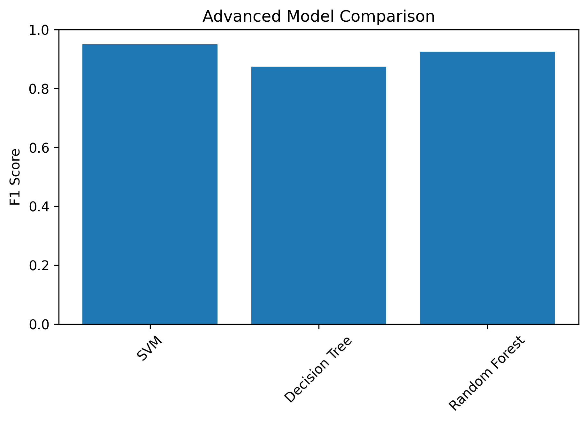
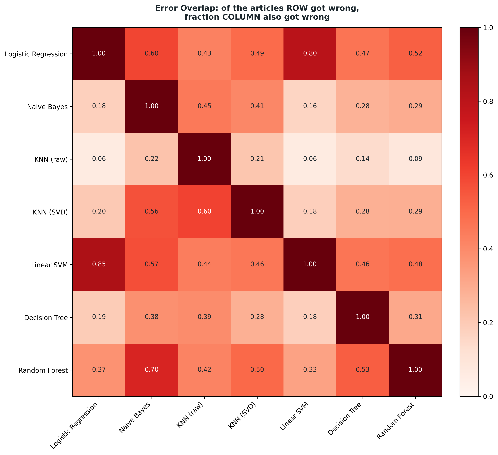
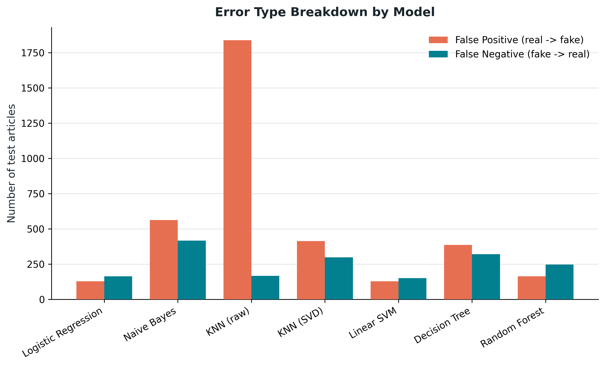

# Fake News Identifier

A machine-learning pipeline for classifying news articles as **real** or **fake** using the WELFake dataset.

This project covers the full workflow from data inspection and preprocessing to feature engineering, model comparison, error analysis, and a local Gradio prediction interface.

## Project Overview

The repository investigates four main research questions:

1.  Which words appear most often in real and fake news articles, and are they meaningful signals or dataset artifacts?
2.  Which classical model performs best with Bag-of-Words or TF-IDF features?
3.  Can dimensionality reduction with Truncated SVD improve K-Nearest Neighbours on high-dimensional text data?
4.  Do different models misclassify the same articles, or do they make different types of errors?

The final pipeline compares multiple text inputs, feature representations, and classification models under a shared train, validation, and test split.

## Dataset

The project uses the **WELFake fake-news classification dataset** downloaded through KaggleHub.

Each record contains:

| Column  | Description           |
|---------|-----------------------|
| `title` | News article headline |
| `text`  | News article body     |
| `label` | Class label           |
| `0`     | Real news             |
| `1`     | Fake news             |

### Data preparation summary

| Stage                                 | Number of articles |
|---------------------------------------|-------------------:|
| Original dataset                      |             72,134 |
| Exact duplicate copies removed        |              8,458 |
| Unique articles after deduplication   |             63,676 |
| Complete articles with title and body |             62,590 |
| Incomplete unique articles            |              1,086 |

Exact duplicates are removed before model training to reduce the risk of the same article appearing in different data splits.

## Pipeline

``` text
WELFake dataset
      |
      v
Exploratory data analysis
      |
      v
Deduplication and complete-case filtering
      |
      v
Text cleaning and source-marker removal
      |
      v
Fixed 80/10/10 train-validation-test split
      |
      v
BoW / TF-IDF feature engineering
      |
      v
Baseline and advanced model training
      |
      v
Model comparison and error-overlap analysis
      |
      v
Gradio prediction interface
```

## Text Preprocessing

The preprocessing pipeline:

-   decodes HTML entities;
-   removes HTML tags;
-   removes URLs and email addresses;
-   removes confirmed source markers such as Reuters, CNN, Fox News, Breitbart, and New York Times;
-   converts text to lowercase;
-   removes punctuation, numbers, and other non-letter symbols;
-   normalizes repeated whitespace;
-   creates title-only, body-only, and combined title-plus-body fields.

Stopword removal, stemming, and lemmatization are intentionally not applied because negation and writing-style information may be useful for fake-news classification.

## Feature Engineering

Three input settings are tested:

-   `title`
-   `body`
-   `combined` title and body

Four sparse text representations are generated:

-   Bag-of-Words unigram
-   TF-IDF unigram
-   TF-IDF unigram and bigram
-   TF-IDF unigram, bigram, and trigram

The default vocabulary limit is 6,000 features, with:

``` text
min_df = 5
max_df = 0.95
random_state = 123
```

Every vectorizer is fitted only on the training split and then applied to the validation and test splits. This prevents vocabulary information from leaking into model training.

An optional BERT feature script is also included. It uses a frozen pretrained transformer and mean pooling to create one dense embedding for each article.

## Models

### Baseline and classical models

-   Logistic Regression
-   Multinomial Naive Bayes
-   K-Nearest Neighbours
-   K-Nearest Neighbours with Truncated SVD

### Advanced models

-   Linear Support Vector Machine
-   Decision Tree
-   Random Forest

Hyperparameters are selected using validation-set F1 score. The test set is reserved for the final evaluation.

## Evaluation Metrics

Each model is evaluated with:

-   Accuracy
-   Precision
-   Recall
-   F1 score
-   Confusion matrix

Per-article predictions are also saved so that mistakes can be compared across models.

## Results

The checked-in advanced-model results use the strongest shared feature configuration:

``` text
combined title and body + TF-IDF unigram and bigram
```

| Model         |   Accuracy |  Precision |     Recall |         F1 |
|---------------|-----------:|-----------:|-----------:|-----------:|
| Linear SVM    | **0.9556** | **0.9536** | **0.9460** | **0.9498** |
| Random Forest |     0.9347 |     0.9396 |     0.9115 |     0.9253 |
| Decision Tree |     0.8870 |     0.8643 |     0.8845 |     0.8743 |



### Error analysis

The common test set contains 6,259 articles.

| Model               | Total errors | Real predicted fake | Fake predicted real |
|-------------------|----------------:|------------------:|------------------:|
| Linear SVM          |      **278** |                 128 |                 150 |
| Logistic Regression |          292 |                 128 |                 164 |
| Random Forest       |          409 |                 163 |                 246 |
| Decision Tree       |          707 |                 386 |                 321 |
| KNN with SVD        |          711 |                 413 |                 298 |
| Naive Bayes         |          978 |                 562 |                 416 |
| Raw KNN             |        2,004 |               1,838 |                 166 |

Truncated SVD substantially improves KNN on the high-dimensional TF-IDF features. Its total errors fall from 2,004 to 711, and its accuracy rises from approximately 68.0% to 88.6%.

Linear SVM and Logistic Regression are the strongest models. They share 235 misclassified articles, although each model also makes some unique errors.





## Repository Structure

``` text
.
├── 00_data.py
├── Wenbo data analysis.py
├── prepare_welfake_handoff.py
├── arunkumar_preprocessing_final_corrected.py
├── ming_feature_engineering.py
├── ming_baseline_modeling.py
├── etta_advanced_models.py
├── BERT_feature_engineering.py
├── QR4_error.py
├── App.py
├── plotting_scripts/
├── part3_outputn/
├── part5_output/
└── rq4_output/
```

### Main scripts

| File | Purpose |
|------------------------------------|------------------------------------|
| `00_data.py` | Downloads the WELFake dataset with KaggleHub |
| `Wenbo data analysis.py` | Performs exploratory data analysis and data-quality checks |
| `prepare_welfake_handoff.py` | Removes exact duplicates and separates complete and incomplete records |
| `arunkumar_preprocessing_final_corrected.py` | Cleans the text and removes confirmed source markers |
| `ming_feature_engineering.py` | Creates the shared split and sparse BoW/TF-IDF features |
| `ming_baseline_modeling.py` | Tunes and evaluates Logistic Regression, Naive Bayes, KNN, and KNN with SVD |
| `etta_advanced_models.py` | Tunes and evaluates Linear SVM, Decision Tree, and Random Forest |
| `BERT_feature_engineering.py` | Optionally creates frozen BERT embeddings |
| `QR4_error.py` | Compares error types and error overlap across models |
| `App.py` | Runs the local Gradio prediction interface |

## Installation

Clone the repository and enter the project directory:

``` bash
git clone https://github.com/mic000/Fake-News-Identifier.git
cd Fake-News-Identifier
```

Create and activate a virtual environment:

``` bash
python -m venv .venv
```

macOS or Linux:

``` bash
source .venv/bin/activate
```

Windows:

``` bash
.venv\Scripts\activate
```

Install the core packages:

``` bash
pip install pandas numpy scipy scikit-learn matplotlib joblib kagglehub gradio
```

For optional BERT embeddings:

``` bash
pip install torch transformers
```

## Running the Full Pipeline

Run all commands from the repository root.

### 1. Download the dataset

``` bash
python 00_data.py
```

The dataset will be saved as:

``` text
data/WELFake_Dataset.csv
```

### 2. Run exploratory data analysis

``` bash
python "Wenbo data analysis.py"
```

This step creates data-quality summaries and exploratory figures.

### 3. Remove duplicates and prepare the handoff files

``` bash
python prepare_welfake_handoff.py
```

Important outputs include:

``` text
handoff/WELFake_stage1_master_deduplicated.csv.gz
handoff/WELFake_stage1_complete_cases.csv.gz
handoff/WELFake_removed_exact_duplicates.csv.gz
handoff/WELFake_incomplete_cases.csv.gz
```

### 4. Clean the text

``` bash
python arunkumar_preprocessing_final_corrected.py \
  --input handoff/WELFake_stage1_complete_cases.csv.gz \
  --output-dir processed
```

Main output:

``` text
processed/WELFake_part2_preprocessed.csv.gz
```

Use `--keep-source-markers` only when intentionally testing the effect of source markers.

### 5. Create BoW and TF-IDF features

``` bash
python ming_feature_engineering.py \
  --input processed/WELFake_part2_preprocessed.csv.gz \
  --output-dir part3_output \
  --target-per-class 150000 \
  --max-features 6000
```

A target larger than the available class counts keeps the full complete-case dataset. Use a smaller value to create a balanced downsampled experiment.

This step saves:

``` text
part3_output/split_assignment.csv
part3_output/feature_summary.csv
part3_output/features/*.npz
part3_output/features/*_vectorizer.joblib
part3_output/features/*_vocab.json
```

### 6. Train the baseline models

``` bash
python ming_baseline_modeling.py \
  --part3-dir part3_output \
  --output-dir part4_output \
  --svd-components 150
```

This step saves model summaries, confusion matrices, trained models, and per-article test predictions.

### 7. Train the advanced models

``` bash
python etta_advanced_models.py
```

This script currently expects the feature files and split assignment inside `part3_output/`.

### 8. Compare model errors

``` bash
python QR4_error.py \
  --part4-predictions-dir part4_output/predictions \
  --part5-predictions-dir part5_output/predictions \
  --output-dir rq4_output
```

### 9. Launch the prediction interface

``` bash
python App.py \
  --part3-dir part3_output \
  --part4-dir part4_output \
  --part5-dir part5_output
```

Open the local address printed by Gradio in a web browser.

The interface uses the project's selected feature configuration:

``` text
combined title and body + TF-IDF unigram and bigram
```

It loads existing vectorizers and trained models. It does not retrain them.

## Optional BERT Features

Generate frozen BERT embeddings while reusing the same train, validation, and test assignments:

``` bash
python BERT_feature_engineering.py \
  --input processed/WELFake_part2_preprocessed.csv.gz \
  --split-file part3_output/split_assignment.csv \
  --output-dir part3_output \
  --model-name bert-base-uncased \
  --max-length 256 \
  --batch-size 16
```

To train models with these embeddings, add `"bert"` to the `REPRESENTATIONS` list in `ming_baseline_modeling.py`.

Do not pair BERT embeddings with `MultinomialNB`, because BERT features can contain negative values.

## Reproducibility

The project uses:

``` text
random_state = 123
train / validation / test = 80% / 10% / 10%
```

The split assignment is saved and reused by all models, which allows direct and fair comparison.

Large generated feature matrices and trained model files are not fully included in the repository. Run the pipeline before launching the application or reproducing every experiment.

## Limitations

-   The classifier learns patterns from the WELFake dataset and may not generalize to news from different time periods, sources, countries, or writing styles.
-   Dataset-specific language can still affect predictions even after confirmed source markers are removed.
-   A high prediction score does not prove that an article is factually true or false.
-   The application is an academic machine-learning demonstration, not a professional fact-checking service.
